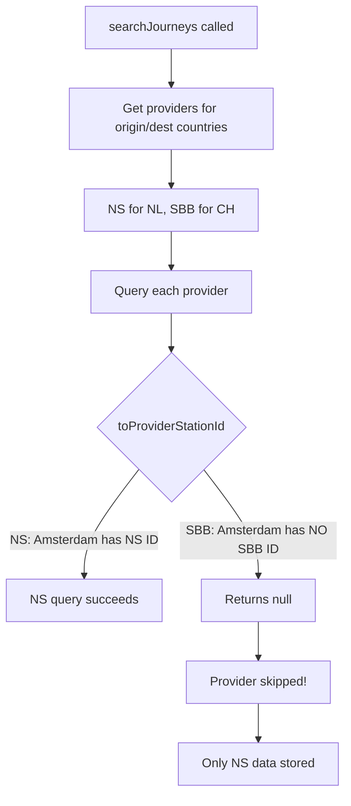

# SBB Integration Fix Plan

## Problem Diagnosis

The SBB API is **never being called** for Amsterdam to Zurich searches. Here's why:



**Root cause in** [`internationalApi.ts`](trainy-web/src/services/internationalApi.ts) lines 196-201:

```typescript
const fromId = provider.toProviderStationId(fromStation);
const toId = provider.toProviderStationId(toStation);

if (!fromId || !toId) {
  logInfo(`${provider.id} missing station IDs, skipping`);
  continue;  // SBB never runs because Amsterdam has no SBB ID
}
```

**Station registry issue** in [`stationRegistry.ts`](trainy-web/src/data/stationRegistry.ts):

- Amsterdam Centraal only has `NS` and `DB` provider IDs
- Zurich HB only has `SBB` and `DB` provider IDs
- No cross-provider UIC codes

## Solution Overview

1. Add SBB UIC codes to all stations in the registry (DE and CH stations)
2. Add NS UIC codes to Swiss stations so NS API can find them
3. Verify the merging logic properly combines data from both providers

## Implementation Steps

### 1. Research UIC Codes for All Registry Stations

Fetch UIC codes from SBB API for all German and Swiss stations:

- Use `transport.opendata.ch/v1/locations?query={stationName}` to look up each station
- Document the UIC codes found for each station

### 2. Update Station Registry with UIC Codes

Update [`stationRegistry.ts`](trainy-web/src/data/stationRegistry.ts) to add SBB provider IDs:

**Netherlands stations** - Add SBB UIC codes:

- Amsterdam Centraal: SBB uses `8400058` (same as DB)
- Utrecht Centraal: SBB uses `8400621`
- etc.

**Germany stations** - Verify/add SBB UIC codes:

- Frankfurt Hbf: `8000105`
- Koln Hbf: `8000207`
- etc.

**Switzerland stations** - Add NS provider IDs (NS uses station names for international):

- Zurich HB: NS uses `"Zürich HB"` (name-based lookup)
- Basel SBB: NS uses `"Basel SBB"`

### 3. Verify Provider Querying Works

After adding UIC codes, verify in console logs:

- Both NS and SBB providers are queried
- Journey data is returned from both
- Merging logic combines the results

### 4. Verify Stop Source Attribution

Check that stops correctly attribute their data source:

- Dutch stops should show "via NS API"
- Swiss stops should show "via SBB API"
- The destination platform should come from SBB

## Files to Modify

| File | Changes |

|------|---------|

| [`stationRegistry.ts`](trainy-web/src/data/stationRegistry.ts) | Add SBB UIC codes for NL/DE stations, add NS names for CH stations |

## Testing

1. Search Amsterdam to Zurich in International tab
2. Verify console shows both NS and SBB being queried
3. Click journey details - verify Zurich platform comes from SBB
4. Check "Data sources" shows both NS and SBB (or "merged")